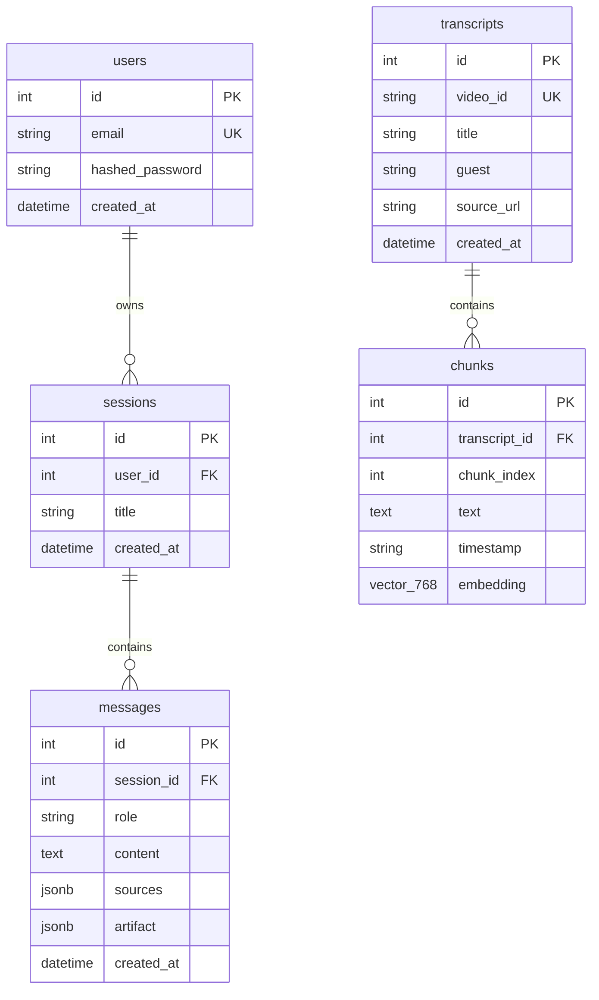

# LennyLens — Technical & Data Architecture

**Document Status:** Current Implementation Baseline  
**Version:** 1.0.0  

---

## 1. High-Level Architecture Diagram

```mermaid
graph TD
    User([User / Browser]) <-->|HTTP / REST| Frontend[Vite + React 18 UI]
    Frontend <-->|REST API /api/v1| FastAPI[FastAPI Backend Server]
    
    subgraph FastAPI Backend Core
        Router[API Routers /sessions & /health]
        AgentRouter[AgentRouter - agent/router.py]
        IntentClassifier[Intent Classifier - agent/intents.py]
        
        Router --> IntentClassifier
        Router --> AgentRouter
        
        AgentRouter -->|intent == 'qna'| QnASkill[QnASkill]
        AgentRouter -->|intent == 'essay'| EssaySkill[EssaySkill]
        AgentRouter -->|intent == 'artifact'| ArtifactSkill[ArtifactSkill]
    end

    subgraph Data & Retrieval Engine
        Retrieval[RetrievalService - services/retrieval.py]
        Embeddings[EmbeddingProvider - services/embeddings.py]
        Grounding[Grounding Engine - services/grounding.py]
        Sanitizer[HTML Sanitizer - services/security.py]

        QnASkill --> Retrieval
        EssaySkill --> Retrieval
        ArtifactSkill --> Retrieval
        
        Retrieval --> Embeddings
        ArtifactSkill --> Grounding
        ArtifactSkill --> Sanitizer
    end

    subgraph Database Layer
        PostgreSQL[(PostgreSQL 15 + pgvector)]
        Retrieval <-->|tsvector Lexical & pgvector Cosine| PostgreSQL
        Router <-->|Session & Message Persistence| PostgreSQL
    end

    subgraph LLM Runtimes (services/llm.py & runtime_config.py)
        LLMProvider{LLM Provider Router}
        QnASkill --> LLMProvider
        EssaySkill --> LLMProvider
        ArtifactSkill --> LLMProvider

        LLMProvider -->|Local| Ollama[Ollama Server: qwen3.5:2b]
        LLMProvider -->|Cloud| OpenAI[OpenAI API: gpt-4o]
        LLMProvider -->|Cloud| Anthropic[Anthropic API: claude-3-5-sonnet]
        LLMProvider -->|Cloud| OpenRouter[OpenRouter API]
    end
```

---

## 2. Component Breakdown

### 2.1 Agent Router & Intent Engine
The agent architecture deliberately uses explicit intent routing over an unconstrained agent loop to guarantee response predictability, safety, and performance.

- **Intent Classification (`agent/intents.py`):**
  - Analyzes the input prompt using deterministic regular expressions and keyword matchers.
  - Classifies queries into `qna`, `essay`, or `artifact`.
  - Expands follow-up queries (e.g., `"compare those two"`) by prepending previous conversation turns.
- **Skill Dispatch (`agent/router.py`):**
  - Maps `qna` to `QnASkill` (invokes `RAGService.answer_question`).
  - Maps `essay` to `EssaySkill` (retrieves transcript evidence, formats prompt via `SHIP30_SYSTEM_PROMPT`).
  - Maps `artifact` to `ArtifactSkill` (extracts evidence, generates JSON payload, validates claims, sanitizes HTML).

### 2.2 Hybrid Retrieval Engine (`services/retrieval.py`)
LennyLens implements a hybrid RAG retrieval pipeline combining lexical and semantic search:

1. **Full-Text Lexical Search:** Uses PostgreSQL `tsvector` and `ts_rank_cd` over combined transcript titles and chunk body text (`plainto_tsquery('english', term)`).
2. **Vector Cosine Search:** Generates query embeddings via `OllamaEmbeddingProvider` (`nomic-embed-text` by default, 768 dimensions) and computes `pgvector` cosine distance: `1 - Chunk.embedding.cosine_distance(query_embedding)`.
3. **Intent-Based Reranking (`rerank_candidates`):** Boosts candidate chunk scores based on title term matches, exact concept coverage, and query intent.
4. **Transcript Diversification (`diversify_chunks`):** Limits chunks per transcript episode (`RETRIEVAL_MAX_PER_TRANSCRIPT = 2`) to ensure evidence spans multiple podcast guests.

### 2.3 Grounding & Validation Engine (`services/grounding.py`)
- **Evidence Extraction:** Deconstructs retrieved chunks into granular sentence-level statements.
- **Claim Verification (`validate_claim`):** Computes a token-overlap ratio between generated claim text and source evidence:
  $$\text{Score} = 0.7 \times \left(\frac{|\text{Tokens}_{\text{claim}} \cap \text{Tokens}_{\text{evidence}}|}{|\text{Tokens}_{\text{claim}}|}\right) + 0.3 \times \left(\frac{|\text{Tokens}_{\text{claim}} \cap \text{Tokens}_{\text{evidence}}|}{|\text{Tokens}_{\text{evidence}}|}\right)$$
  Claims with $\text{Score} < \text{GROUNDING\_MIN\_CONFIDENCE}\ (0.45)$ or missing required citations are rejected.
- **Fallback Builder (`_build_evidence_artifact`):** If model prose fails validation, a clean evidence-only document is generated directly from raw transcript statements.

---

## 3. Database Schema

The database relies on PostgreSQL 15 with the `pgvector` extension, managed via SQLAlchemy (asyncpg) and Alembic migrations.



### Key Table Definitions
- `users`: Stores user identity (`local-demo@example.invalid` demo user).
- `sessions`: Stores conversation session containers per user.
- `messages`: Persists user prompts and assistant outputs, including JSON payloads for `sources` and `artifact`.
- `transcripts`: Metadata for indexed podcast episodes (title, guest name, YouTube source URL).
- `chunks`: Segmented transcript text blocks with 768-dimensional `pgvector` embeddings (`vector(768)`).

---

## 4. LLM & Runtime Abstraction

### 4.1 Base Provider Interface (`services/llm.py`)
All LLM integrations implement the `BaseLLMProvider` abstract base class:

```python
class BaseLLMProvider(ABC):
    @abstractmethod
    async def generate_response(
        self,
        prompt: str,
        system_prompt: str | None = None,
        max_tokens: int = 2048
    ) -> str:
        pass
```

### 4.2 Supported Providers
- `OllamaProvider`: Calls local Ollama REST API (`/api/generate`). Default model: `qwen3.5:2b`.
- `OpenAIProvider`: Calls OpenAI ChatCompletions API (`/v1/chat/completions`). Default model: `gpt-4o`.
- `AnthropicProvider`: Calls Anthropic Messages API (`/v1/messages`). Default model: `claude-3-5-sonnet-20241022`.
- `OpenRouterProvider`: Calls OpenRouter API endpoint.

### 4.3 In-Memory Dynamic Runtime Config (`services/runtime_config.py`)
- Evaluator model selection is managed in server memory via `set_active_llm_config(provider, model, api_key)`.
- Switches model execution instantly without container restarts. API keys are kept strictly in memory for security.
