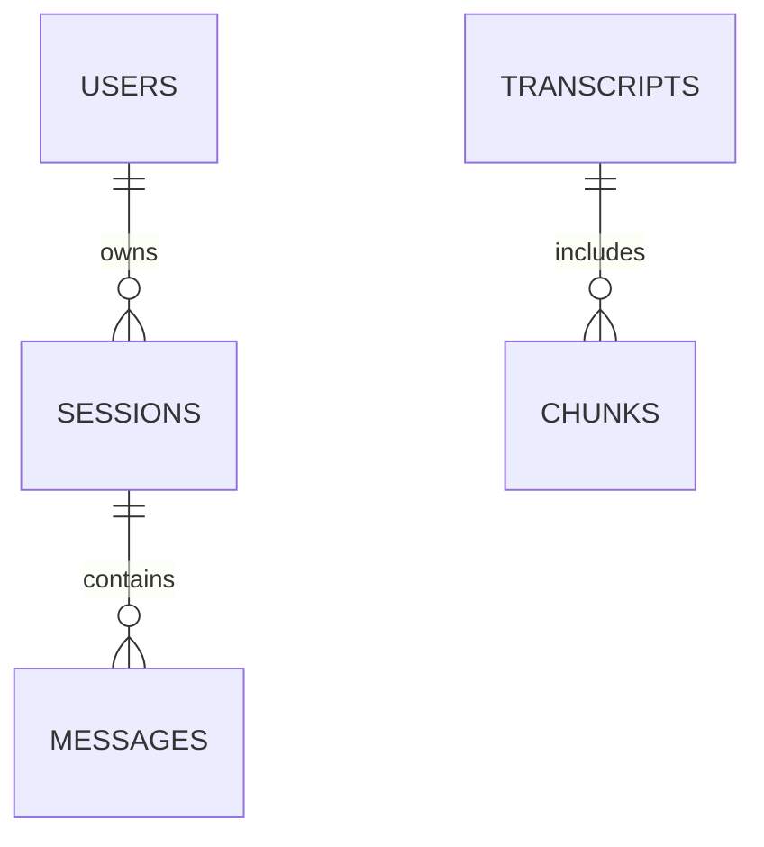

# LennyLens Architecture

## 1. Architecture philosophy
LennyLens uses a modular monolith rather than a distributed microservice design. This keeps the system easy to run, reason about, and hand off to an evaluator while still preserving strong boundaries between frontend, API, agent logic, retrieval, database, and security.

The architecture follows these principles:
- Keep the system simple and explicit.
- Separate concerns across layers.
- Keep retrieval and generation distinct.
- Treat LLM output as untrusted data.
- Make model switching configuration-driven, not code-driven.
- Keep session data isolated and persistent.
- Favor reliability and grounded answers over broad feature scope.

---

## 2. High-level system design

```text
                    ┌────────────────────────────┐
                    │        Frontend            │
                    │  React + TypeScript        │
                    └────────────┬───────────────┘
                                 │ HTTP / SSE
                                 ▼
                    ┌────────────────────────────┐
                    │        FastAPI             │
                    │      API + validation      │
                    └────────────┬───────────────┘
                                 │
                                 ▼
                    ┌────────────────────────────┐
                    │   Application Services     │
                    │ sessions / chat / artifacts│
                    └────────────┬───────────────┘
                                 │
            ┌────────────────────┼─────────────────────┐
            │                    │                     │
            ▼                    ▼                     ▼
    ┌───────────────┐   ┌──────────────────┐   ┌───────────────┐
    │ Agent Router  │   │  Retrieval Layer │   │  LLM Provider  │
    │ + Skills      │   │ embeddings + RAG │   │ abstraction    │
    └───────┬───────┘   └─────────┬────────┘   └───────┬───────┘
            │                     │                      │
            ├─────────────┬───────┴───────────────┬──────┤
            │             │                       │      │
            ▼             ▼                       ▼      ▼
    ┌───────────┐ ┌───────────────┐      ┌───────────┐ ┌───────────┐
    │ Q&A Skill │ │ Ship30 Skill  │      │  Ollama   │ │ Cloud LLM │
    └─────┬─────┘ └───────┬───────┘      └───────────┘ └───────────┘
          │                 │
          └────────┬────────┘
                   ▼
            ┌──────────────────┐
            │ PostgreSQL +     │
            │ vector store     │
            │ sessions +       │
            │ transcripts +    │
            │ chunk metadata   │
            └──────────────────┘
```

---

## 3. Frontend architecture boundary
The frontend is responsible only for presentation and user interaction.

### Frontend responsibilities
- Render the chat UI
- Show session list and active session state
- Collect user input
- Submit requests to backend endpoints
- Render assistant responses and source citations
- Render generated Markdown or sanitized HTML artifacts
- Display loading, empty, and error states
- Show active model/provider selection

### Frontend must not own
- LLM prompt construction
- Retrieval logic
- Database access
- Agent routing
- Secret management
- Artifact sanitization decisions

This keeps the frontend thin and avoids duplicating critical backend logic.

---

## 4. Backend architecture
The backend is a layered FastAPI application with clear component boundaries.

### Suggested layer structure
```text
backend/
├── app/
│   ├── api/
│   │   ├── routes/
│   │   │   ├── health.py
│   │   │   ├── sessions.py
│   │   │   ├── chat.py
│   │   │   └── artifacts.py
│   │   └── dependencies.py
│   ├── core/
│   │   ├── config.py
│   │   ├── logging.py
│   │   └── errors.py
│   ├── db/
│   │   ├── models/
│   │   ├── session.py
│   │   └── migrations/
│   ├── schemas/
│   │   ├── chat.py
│   │   ├── session.py
│   │   └── artifact.py
│   ├── services/
│   │   ├── session_service.py
│   │   ├── chat_service.py
│   │   └── artifact_service.py
│   ├── agent/
│   │   ├── router.py
│   │   ├── orchestrator.py
│   │   └── skills/
│   │       ├── qa_skill.py
│   │       ├── ship30_skill.py
│   │       └── artifact_skill.py
│   ├── rag/
│   │   ├── chunking.py
│   │   ├── embeddings.py
│   │   ├── retrieval.py
│   │   └── prompt_builder.py
│   ├── llm/
│   │   ├── provider.py
│   │   ├── factory.py
│   │   ├── ollama_provider.py
│   │   └── cloud_provider.py
│   └── security/
│       ├── html_sanitizer.py
│       └── artifact_policy.py
└── tests/
```

### Layer responsibilities
- API routes: HTTP handling and validation
- Services: business logic orchestration
- Agent: request classification and skill execution
- RAG: retrieval, chunking, embeddings, context construction
- DB: data persistence and access
- Security: sanitization, HTML controls, trust boundaries

---

## 5. API contracts
The initial API boundary should be defined before implementation.

### 5.1 Health
Request:
```http
GET /health
```
Response:
```json
{
  "status": "ok"
}
```

### 5.2 Create session
Request:
```http
POST /api/v1/sessions
```
Response:
```json
{
  "session_id": "uuid",
  "created_at": "2026-09-12T00:00:00Z"
}
```

### 5.3 List sessions
Request:
```http
GET /api/v1/sessions
```
Response:
```json
{
  "sessions": [
    {
      "id": "uuid",
      "title": "Product strategy discussion",
      "created_at": "2026-09-12T00:00:00Z",
      "updated_at": "2026-09-12T00:00:00Z"
    }
  ]
}
```

### 5.4 Get session history
Request:
```http
GET /api/v1/sessions/{session_id}
```
Response:
```json
{
  "id": "uuid",
  "title": "Product strategy discussion",
  "messages": [
    {
      "id": "msg-1",
      "role": "user",
      "content": "What did the podcast say about product-market fit?",
      "created_at": "2026-09-12T00:00:00Z"
    }
  ]
}
```

### 5.5 Chat
Request:
```http
POST /api/v1/chat
```
Body:
```json
{
  "session_id": "uuid",
  "message": "How should a startup think about product-market fit?"
}
```
Response:
```json
{
  "message_id": "uuid",
  "content": "The transcript suggests ...",
  "sources": [
    {
      "transcript_id": "uuid",
      "title": "Episode 42",
      "speaker": "Lenny",
      "relevance_score": 0.92,
      "source_url": "https://example.com"
    }
  ],
  "model": {
    "provider": "ollama",
    "name": "llama3.1"
  }
}
```

### 5.6 Artifact generation
Artifacts are created by the essay and artifact skills during chat. There is no separate `POST /artifacts` route; the chat response carries a first-class `artifact` object and the same payload is persisted on `messages.artifact`.

```http
POST /api/v1/sessions/{session_id}/chat
```

```json
{
  "message": { "role": "assistant", "content": "Created a one-page strategy canvas from 4 episodes." },
  "intent": "artifact",
  "sources": [
    {
      "n": 1,
      "title": "Product discovery interview",
      "guest": "Teresa Torres",
      "source_url": "https://www.youtube.com/watch?v=xxxxx&t=94s",
      "excerpt": "Teams validate problems before building.",
      "timestamp": "1:34",
      "chunk_id": 123
    }
  ],
  "artifact": {
    "type": "html",
    "title": "Discovery canvas",
    "content": "<h1>Canvas</h1>",
    "summary": "A one-page canvas."
  }
}
```

Ship 30 essays use the same contract with `"type": "markdown"` so they open in the artifact viewer instead of a chat bubble.

### 5.7 Error model
Errors should use a consistent shape:
```json
{
  "error": {
    "code": "OLLAMA_UNAVAILABLE",
    "message": "The local Ollama model is unavailable."
  }
}
```

---

## 6. Database architecture
The application uses PostgreSQL as the durable source of truth.

### Core entities
- users
- sessions
- messages (content, sources JSON, artifact JSON)
- transcripts
- transcript_chunks

### Entity relationships


### Schema intent
```text
users
- id (UUID primary key)
- external_id
- display_name
- created_at

sessions
- id (UUID primary key)
- user_id (FK)
- title
- created_at
- updated_at

messages
- id (UUID primary key)
- session_id (FK)
- role (user/assistant/system)
- content (text)
- metadata (JSON)
- created_at

transcripts
- id (UUID primary key)
- source_id (unique)
- title
- source_url
- speaker
- metadata (JSON)
- ingested_at

transcript_chunks
- id (UUID primary key)
- transcript_id (FK)
- chunk_index
- content (text)
- embedding (vector)
- metadata (JSON)
- created_at

artifacts
- id (UUID primary key)
- session_id (FK)
- type
- title
- content (text)
- metadata (JSON)
- created_at
```

### Indexing notes
- Index on session_id for messages
- Index on transcript_id for chunks
- Unique constraint on transcript source_id
- Index on chunk metadata for filtering
- Vector index for similarity search

---

## 7. Vector storage and retrieval design
The retrieval system uses PostgreSQL vector storage to keep the architecture simple and operationally reliable.

### Why this design
- No separate vector database is required.
- Database and retrieval remain in one deployment unit.
- Metadata and embeddings live close to transcript records.

### Retrieval flow
```text
User question
   ↓
Embed query
   ↓
Similarity search over transcript chunks
   ↓
Top-K relevant chunks
   ↓
Context builder
   ↓
Grounded prompt
```

### Example retrieval result
```json
{
  "chunk_id": "uuid",
  "transcript_id": "uuid",
  "content": "...",
  "title": "Episode 42",
  "source_url": "https://example.com",
  "speaker": "Lenny",
  "relevance_score": 0.91
}
```

### Retrieval safeguards
- Bound the result list to top K chunks
- Filter by metadata such as title, source, or episode when needed
- Preserve source provenance in every result
- Never answer without transcript-backed evidence

---

## 8. Transcript ingestion architecture
The ingestion pipeline turns raw transcript data into queryable, source-aware chunks.

```text
Transcript source
   ↓
Load raw transcript files
   ↓
Normalize/clean text
   ↓
Extract metadata
   ↓
Chunk transcript
   ↓
Generate embeddings
   ↓
Store in PostgreSQL + vector index
```

### Ingestion requirements
- Idempotent: repeat runs should not duplicate transcripts
- Traceable: source URL and transcript metadata must be retained
- Refreshable: updates should be reconciled by source key
- Version-safe: chunk metadata should include source context

### Source metadata
Each transcript or chunk should retain:
- title
- episode or source id
- speaker
- timestamp
- source url
- chunk index

---

## 9. RAG pipeline design
The retrieval pipeline is separate from generation.

```text
Question
   ↓
Embed query
   ↓
Top-K chunk retrieval
   ↓
Context assembly
   ↓
Grounded prompt
   ↓
LLM response
   ↓
Answer + citations
```

### Grounding rules
- The transcript corpus is the source of truth.
- Use retrieved transcript chunks as evidence.
- Cite relevant source metadata.
- If evidence is weak or missing, return a clear boundary statement.

### Context assembly
The prompt should combine:
- current user question
- session memory (recent relevant history)
- transcript evidence
- explicit grounding instructions

---

## 10. Agent architecture and routing
The application uses a simple agent router with a few explicit skills instead of a coding-agent loop.

The take-home mentions the Anthropic Claude Agent SDK and Pi Coding Agent. Those runtimes are designed for filesystem and shell work. This product is a grounded research assistant over a private transcript corpus, so giving the model a general coding loop would weaken isolation, make routing harder to test, and invite hallucinated files. Skills are explicit tools (Q&A, Ship 30, Artifact) with structured inputs and outputs. LLM calls happen after retrieval, not as an unconstrained agent.

```text
User request
    ↓
Deterministic intent classifier
    ├── Q&A skill
    ├── Ship 30 skill
    └── Artifact skill
         ↓
Retrieve → number evidence → generate → filter unused citations
```

### Routing decisions
- Question about transcripts → Q&A skill
- Request for essay or long-form writing → Ship 30 skill
- Request to generate a document/artifact → Artifact skill

### Skill boundaries
- Q&A skill: grounded answer generation with citations
- Ship 30 skill: structured long-form writing using transcript evidence
- Artifact skill: create markdown/html deliverables for user review

These skills must be independently testable and easy to reason about.

---

## 11. LLM abstraction design
The app uses a provider abstraction so the system can switch from local to cloud model configuration without changing business logic.

```text
LLMProvider
   ├── OllamaProvider
   └── CloudProvider
```

### Interface responsibilities
- initialize model client
- generate model output
- expose provider metadata
- surface runtime error states

### Why this matters
- Local demonstration with Ollama must work.
- Cloud models can be used when available.
- Switches should be environment-driven rather than hardcoded.

---

## 12. Runtime model configuration
Use environment variables in .env and .env.example.

Example:
```env
LLM_PROVIDER=ollama
OLLAMA_BASE_URL=http://localhost:11434
OLLAMA_MODEL=llama3.1

# or
# LLM_PROVIDER=anthropic
# ANTHROPIC_API_KEY=...
```

### Configuration requirements
- Model provider is selected by config
- Model name is explicit and visible in logs
- Missing configuration should trigger a clear error
- Fallback behavior should be explicit and documented

---

## 13. Conversation state architecture
Sessions hold independent conversation state.

### Session responsibilities
- persist the conversation timeline
- keep user and assistant messages separate
- allow load-by-session retrieval
- prevent cross-session leakage

### Design rule
Two sessions must never silently share context.

A query should combine:
- session memory (recent messages within that session)
- retrieval results from transcript knowledge
- the current user prompt

---

## 14. Artifact generation pipeline
Artifacts should be generated from grounded content and rendered safely.

```text
User instruction
   ↓
Artifact skill
   ↓
Generate markdown or HTML
   ↓
Validate content
   ↓
Sanitize HTML
   ↓
Store artifact metadata
   ↓
Render in artifact viewer
```

### Artifact types
- Markdown artifact
- HTML artifact

### Artifact storage
Artifacts are JSON on the parent assistant message (`messages.artifact`). Chat `content` is always human-readable; the viewer reopens the structured payload after refresh.

### Citation contract
Each source is numbered to match `[n]` in the answer: title, guest, excerpt, optional timestamp parsed from the transcript, and a source URL. YouTube `t=` deep links are added only when a real timestamp was parsed. Retrieval diversifies to at most two chunks per episode. Unused `[n]` sources are dropped from the UI payload.

---

## 15. Artifact security architecture
Generated HTML is treated as untrusted content.

### Trust boundaries
```text
Trusted app code and backend logic
     |
     |--- boundary ---|
Untrusted: user input, generated HTML, transcript content
```

### Security strategy
- sanitize HTML server-side with Bleach (allowlist of tags/CSS; no scripts, forms, iframes, or network images)
- remove event handlers and executable tags
- block javascript: protocols
- render in an iframe with an empty `sandbox` attribute plus a restrictive CSP in `srcDoc`
- never inject raw generated HTML into the main application DOM
- Preview/Source tabs expose the sanitized markup without executing it

### Example unsafe inputs to block
- script tags
- img onerror
- javascript: URLs
- inline event handlers
- style-based script triggers

---

## 16. Observability architecture
Observability is required to diagnose model failures, retrieval issues, and UI problems.

### Structured logging
Example:
```json
{
  "event": "llm_request",
  "request_id": "req_123",
  "session_id": "sess_456",
  "provider": "ollama",
  "model": "llama3.1",
  "latency_ms": 1820,
  "success": true
}
```

### Logged dimensions
- request_id
- session_id
- model provider
- model name
- retrieval latency
- LLM latency
- DB read/write timing
- artifact generation duration
- failure codes and messages

---

## 17. Failure handling design
The application must degrade gracefully when critical dependencies fail.

### Failure matrix
| Failure | Expected behavior |
| --- | --- |
| Missing API key | Return a configuration error and avoid a blind retry |
| Ollama unavailable | Graceful fallback or clear error state |
| Cloud model unavailable | Surface provider failure without crashing app |
| Database unavailable | Return a controlled service error and log the failure |
| Empty retrieval | Inform the user that evidence is insufficient |
| LLM timeout | Stop, surface timeout, and provide a useful message |
| Invalid artifact | Reject or sanitize before rendering |

### Error handling rule
The app must never pretend an answer is grounded when the retrieval layer returned nothing relevant.

---

## 18. Deployment topology
The intended deployment is a local Docker Compose environment for evaluator use.

```text
Browser
   ↓
Frontend container
   ↓
FastAPI backend container
   ├── PostgreSQL service
   └── Ollama/local model service
```

### Deployment goals
- one-command local startup
- simple developer environment
- reproducible evaluator handoff
- environment-driven configuration

### Example startup flow
```bash
docker compose up --build
```

---

## 19. Security and environment configuration
The app must use a .env.example file and never commit secrets.

Example:
```env
DATABASE_URL=postgresql://postgres:postgres@db:5432/lennylens
LLM_PROVIDER=ollama
OLLAMA_BASE_URL=http://ollama:11434
OLLAMA_MODEL=llama3.1
```

### Hard requirements
- no committed .env
- no hardcoded API keys
- no secrets in logs
- parameterized database queries only

---

## 20. Why this architecture is appropriate
This design is strong because it matches the real evaluation criteria:
- clear component boundaries
- grounded retrieval rather than generic chat
- session isolation and persistence
- strong model abstraction and local/cloud flexibility
- artifact security and safe rendering
- operational failure handling
- reproducible deployment and documentation

It avoids unnecessary complexity while still showing engineering maturity.

---